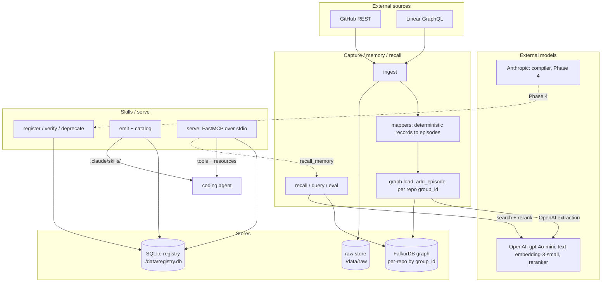

# Architecture

Relic is two halves over one contract. The capture half builds memory from
engineering history. The serve half delivers grounded skills to coding agents.
The contract between them is `SkillIR`, the typed record that is the compiler's
output, the registry row, and the MCP tool schema, all one type.

## The two halves

**Capture, memory, recall (the graph side).** Pull engineering history, structure
it in a temporal knowledge graph, and answer questions against it with sources
attached. This is `ingest`, `recall`, `query`, and `eval`. It is backed by
Graphiti on FalkorDB and uses OpenAI for extraction, embeddings, and reranking.

**Skills, serve (the registry side).** Hold typed skills, move them through a
lifecycle, and deliver them to agents as files or over MCP. This is `register`,
`list`, `show`, `verify`, `deprecate`, `emit`, `catalog`, and `serve`. It is
backed by a SQLite registry and has no graph or network dependency.

The halves are deliberately decoupled. The serve side never imports the graph
side. The MCP server takes a recall function by injection rather than importing
it ([`mcp_server.py`](../src/relic/serve/mcp_server.py)), so skills can be served
even when the graph is unreachable.

## The one contract: SkillIR

`SkillIR` ([`skill_ir.py`](../src/relic/ontology/skill_ir.py)) is the seam. The
same type is:

- what the Phase 4 compiler will emit,
- the JSON document stored in the registry,
- the input schema for the MCP tool a skill becomes,
- the model rendered to `SKILL.md`.

Because one type does all four jobs, the typed contract and the rendered document
cannot drift. The MCP tool's input schema is built directly from `SkillIR.inputs`
([`input_schema`](../src/relic/serve/mcp_server.py)), and the `SKILL.md` is
rendered from the same record by a deterministic Jinja template
([`render.py`](../src/relic/compile/render.py)).

## The two stores

Memory and skills live in separate stores on purpose.

**The graph (memory).** A FalkorDB graph, accessed through Graphiti. It holds
people, repos, pull requests, reviews, issues, and the edges between them,
extracted from episodes. It is partitioned per repo by `group_id`. See
[memory-and-recall.md](memory-and-recall.md).

**The registry (skills).** A SQLite database at `./data/registry.db`. It holds
`SkillIR` documents plus denormalized columns for cheap listing. See
[skills.md](skills.md).

A third store sits beside them: the **raw store**, plain JSON files under
`./data/raw/<source>/<id>.json`, an immutable copy of every fetched payload so a
skill can always cite the original ([`raw_store.py`](../src/relic/ingest/raw_store.py)).

## System diagram



## Runtime model

Relic is not a single running service. It is a set of processes, most of them
short-lived CLI invocations, over shared stores. See
[processes.md](processes.md) for each one in detail.

- **CLI commands** are one-shot. `ingest`, `recall`, `query`, `eval`, `emit`,
  and the rest run, do their work, and exit. The async ones
  (`ingest`/`recall`/`query`/`eval`/`serve`) wrap their body in `asyncio.run`.
- **`relic serve`** is the one long-running process. It speaks MCP over stdio and
  stays up for the life of the client connection.
- **FalkorDB** is a persistent service, run locally via Docker
  ([`docker-compose.yml`](../docker-compose.yml)) on `localhost:6379`. It must be
  up before any graph command.
- **OpenAI and Anthropic** are external HTTP APIs called per run.

The CLI is import-light by design. Only typer and rich load at module import, so
`relic --help` stays fast and needs no keys. Each command imports its heavy
dependencies (Graphiti, the connectors) inside the command body
([`cli.py`](../src/relic/cli.py)).

## Module layout

```
src/relic/
├── cli.py            # typer CLI: the entry point for every command
├── config.py         # pydantic-settings, loaded from .env
├── doctor.py         # read-only health check
├── scorecard.py      # recall eval against a gold set
├── ontology/         # the type layers (see data-model.md)
│   ├── primitives.py # Id, TimeRange, Money, Link, AuditInfo, ...
│   ├── entities.py   # Person, Repo, PullRequest, Review, Issue, Procedure
│   ├── org.py        # Employee, Team, Customer, Product, Project, ...
│   └── skill_ir.py   # FieldSpec, Citation, SkillIR (the contract)
├── ingest/           # capture from sources (see ingestion.md)
│   ├── github.py     # async GitHub pulls
│   ├── linear.py     # GraphQL Linear pulls
│   ├── mappers.py    # deterministic records + episode transforms
│   └── raw_store.py  # dump raw payloads to disk
├── graph/            # the memory engine (see memory-and-recall.md)
│   ├── engram.py     # Graphiti factory + flat graph types + FalkorDB patch
│   ├── load.py       # add episodes sequentially
│   ├── recall.py     # general fact recall with provenance
│   └── queries.py    # people-focused query with Cypher fallback
├── resolve/people.py # cross-source person resolution (Phase 3 stub)
├── compile/          # procedure to skill (see skills.md)
│   ├── detect.py     # deterministic procedure detector (Phase 4 stub)
│   ├── compiler.py   # LLM fills SkillIR from evidence (Phase 4 stub)
│   └── render.py     # SkillIR to SKILL.md via Jinja (wired)
├── registry/store.py # SQLite skill store
└── serve/            # deliver skills (see skills.md)
    ├── emit_files.py # write verified skills to .claude/skills/
    ├── catalog.py    # render the human index
    └── mcp_server.py # FastMCP server: skills as tools + recall_memory
```

`pipeline/run.py` is the future full-run orchestrator (ingest, resolve, detect,
compile). It raises `NotImplementedError` today and lands across Phases 4 to 8.

## Key design decisions

**Deterministic-first ingestion.** GitHub and Linear are already structured, so
the connectors and mappers build records with no LLM and no network beyond the
source API ([`mappers.py`](../src/relic/ingest/mappers.py) is pure). The LLM
enters only at the Graphiti extraction step, where episodes become typed graph
entities. This keeps provenance clean and cost bounded.

**The LLM goes in the compiler, not the detector.** When Phase 4 lands, procedure
detection will be a deterministic graph query plus a support and confidence
threshold. The LLM will only compile already-grounded evidence into a `SkillIR`.
That is what makes the candidates trustworthy.

**Three type layers, not one.** The rich ontology in `ontology/` is the source of
truth for the typed domain. Graphiti needs flat scalar models, so `engram.py`
holds a separate flat `*Node` layer. `SkillIR` is its own ported-verbatim
contract. See [data-model.md](data-model.md) for why.

**Cheap model for the graph, frontier model for compilation.** Graphiti uses
OpenAI `gpt-4o-mini` for extraction and reranking and `text-embedding-3-small`
for search. The Phase 4 compiler will use Anthropic for the harder
grounded-synthesis job.

**Provenance is mandatory.** Every recalled fact carries its source episodes, and
every source resolves to a PR or issue URL where possible
([`recall.py`](../src/relic/graph/recall.py)). Every skill carries citations. A
fact or claim with no source is not the point of the system.

## The stack

| Concern | Choice |
|---|---|
| Language, runtime | Python 3.12, `uv` |
| Memory engine | Graphiti `0.29.x` |
| Graph DB | FalkorDB, self-hosted via Docker in dev |
| Graph LLM, embeddings, rerank | OpenAI `gpt-4o-mini`, `text-embedding-3-small` |
| Skill compiler (Phase 4) | Anthropic |
| Registry | SQLite (Postgres later) |
| Raw store | local files (R2 later) |
| Serve | FastMCP 3.x over stdio, plus `.claude/skills/` files |
| CLI | typer, rich |

The graph DB was migrated from embedded Kuzu to FalkorDB. FalkorDB was chosen for
multi-tenant `group_id` partitioning (per-repo graphs) and working full-text
search. See [memory-and-recall.md](memory-and-recall.md) and
[roadmap.md](roadmap.md).
