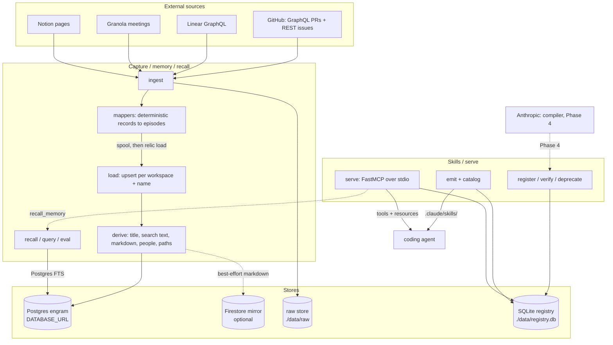

Relic is two halves over one contract. The capture half builds memory from
engineering history. The serve half delivers grounded skills to coding agents.
The contract between them is `SkillIR`, the typed record that is the compiler's
output, the registry row, and the MCP tool schema, all one type.

## The two halves

<CardGroup cols={2}>
  <Card title="Capture, memory, recall" icon="brain">
    The engram side. Pull engineering history, land it as typed rows in the
    engram store, and answer questions against it with sources attached. This is
    `ingest`, `load`, `recall`, `query`, and `eval`. It is backed by Postgres
    (full-text search) with an optional Firestore document mirror. No LLM at
    ingest or recall.
  </Card>
  <Card title="Skills, serve" icon="screwdriver-wrench">
    The registry side. Hold typed skills, move them through a lifecycle, and deliver
    them to agents as files or over MCP. This is `register`, `list`, `show`,
    `verify`, `deprecate`, `emit`, `catalog`, and `serve`. It is backed by a SQLite
    registry and has no store or network dependency.
  </Card>
</CardGroup>

The halves are deliberately decoupled. The serve side never imports the engram
side. The MCP server takes a recall function by injection rather than importing
it ([`mcp_server.py`](https://github.com/buildrelic/relic-core/blob/main/packages/relic-serve/src/relic/serve/mcp_server.py)), so skills can be served
even when the store is unreachable.

## The one contract: SkillIR

`SkillIR` ([`skill_ir.py`](https://github.com/buildrelic/relic-core/blob/main/packages/relic-core/src/relic/ontology/skill_ir.py)) is the seam. The
same type is:

- what the Phase 4 compiler will emit,
- the JSON document stored in the registry,
- the input schema for the MCP tool a skill becomes,
- the model rendered to `SKILL.md`.

Because one type does all four jobs, the typed contract and the rendered document
cannot drift. The MCP tool's input schema is built directly from `SkillIR.inputs`
([`input_schema`](https://github.com/buildrelic/relic-core/blob/main/packages/relic-serve/src/relic/serve/mcp_server.py)), and the `SKILL.md` is
rendered from the same record by a deterministic Jinja template
([`render.py`](https://github.com/buildrelic/relic-core/blob/main/packages/relic-serve/src/relic/serve/render.py)).

## The stores

Memory and skills live in separate stores on purpose.

**The engram store (memory).** Postgres, authoritative, addressed by
`DATABASE_URL`. Relational tables (`workspaces`, `people`, `memories`,
`memory_people`, `memory_paths`) hold one row per artifact, scoped by workspace
and partitioned by `scope`. Firestore, when configured (`FIREBASE_*`), mirrors
each memory as a document with rendered markdown for the web workspace;
Postgres stays authoritative and the mirror is best-effort. See
[Memory and recall](/memory-and-recall).

**The registry (skills).** A SQLite database at `./data/registry.db`. It holds
`SkillIR` documents plus denormalized columns for cheap listing. See
[Skills](/skills).

A third store sits beside them: the **raw store**, plain JSON files under
`./data/raw/<source>/<id>.json`, an immutable copy of every fetched payload so a
skill can always cite the original ([`raw_store.py`](https://github.com/buildrelic/relic-core/blob/main/packages/relic-ingest/src/relic/ingest/raw_store.py)).

## System diagram



## Runtime model

Relic is not a single running service. It is a set of processes, most of them
short-lived CLI invocations, over shared stores. See
[Processes](/processes) for each one in detail.

- **CLI commands** are one-shot. `ingest`, `recall`, `query`, `eval`, `emit`,
  and the rest run, do their work, and exit. The async ones
  (`ingest`/`load`/`recall`/`query`/`eval`/`serve`) wrap their body in `asyncio.run`.
- **`relic serve`**, **`relic daemon`**, and **`relic serve-http`** are the
  long-running processes: the MCP server over stdio, the closed-loop daemon on
  `127.0.0.1:8788`, and the web app's HTTP surface on `127.0.0.1:8787`.
- **Postgres** is a persistent service, run locally via Docker
  ([`docker-compose.yml`](https://github.com/buildrelic/relic-core/blob/main/docker-compose.yml)) on `localhost:5432` (`just up`). It must be
  up before any store command.
- **Anthropic** is an external HTTP API, reserved for the Phase 4 compiler.

<Note>
The CLI is import-light by design. Only typer and rich load at module import, so
`relic --help` stays fast and needs no keys. Each command imports its heavy
dependencies (asyncpg, the connectors) inside the command body
([`cli.py`](https://github.com/buildrelic/relic-core/blob/main/packages/relic-cli/src/relic/cli.py)).
</Note>

## Workspace layout

Relic is a uv workspace of installable packages, one per owned subsystem plus a
shared core. Each package declares its own dependencies, so a package can import
another only if it depends on it, and only that package's public API (its
`__init__.py`). The dependency graph is the interface contract. Import paths stay
`relic.*`: `relic` is a PEP 420 namespace package the distributions merge into.

```
packages/
├── relic-core/       # shared, jointly owned: the interface layer
│   └── src/relic/
│       ├── contracts/  # EpisodeSpec, episode bodies, RecallFn, SkillIR: the seams
│       ├── ontology/   # the typed domain models (see data-model.md)
│       ├── config.py   # pydantic-settings, loaded from .env
│       └── obs.py      # logging to stderr + the shared ingest progress-bar wiring
├── relic-ingest/     # Paris: capture from sources (see ingestion.md)
│   └── src/relic/ingest/   # github, linear, granola, notion, mappers, sessions, raw_store, checkpoint
├── relic-engram/     # Abhinav: the memory/retrieval store (see memory-and-recall.md)
│   └── src/relic/
│       ├── engram/     # store, derive, recall, load, queries, documents
│       ├── compile/    # detect + compiler (Phase 4 stubs)
│       ├── resolve/    # cross-source person resolution (Phase 3 stub)
│       └── scorecard.py # recall eval against a gold set
├── relic-serve/      # Zidan: deliver skills (see skills.md)
│   └── src/relic/
│       ├── serve/      # mcp_server, daemon_app, http_server, emit_files, catalog, render
│       └── registry/   # SQLite skill store
└── relic-cli/        # Zidan: the composition root
    └── src/relic/
        ├── cli.py      # typer CLI: wires the three subsystems together
        ├── doctor.py   # read-only health check
        ├── hooks/      # the Claude Code hook shim (stdlib-only)
        └── __main__.py
```

The dependency graph (and the rule it encodes):

```
relic-core                        pydantic, pydantic-settings, rich
  ^      ^      ^
ingest  engram  serve             each depends on relic-core only; mutually independent
  ^      ^      ^
       relic-cli                  the only package that depends on all three
```

The three subsystems never import each other. They interact only through types in
`relic.contracts`, and `relic.cli` (the composition root) builds the concrete
implementations and injects them. The recall seam is the model: `relic-serve`
takes a `RecallFn` and never imports `relic-engram`; `relic.cli` builds the recall
function from the store and injects it. `import-linter` contracts in the root
`pyproject.toml` fail the build if a subsystem reaches across a boundary.

The **daemon** is a composition root of its own (`relic daemon` in `relic-cli`).
It holds one lazily-built engram store (`_StoreHandle`, so the daemon boots even
with Postgres down), injects a `RecallFn` and a capture function into a loopback
HTTP surface ([`daemon_app.py`](https://github.com/buildrelic/relic-core/blob/main/packages/relic-serve/src/relic/serve/daemon_app.py),
`build_daemon_app`), and closes the loop: Claude Code hooks call `inject` to recall
context onto each prompt and `capture` to write the finished session back as an
AgentSession episode through the same `load_episodes` ingest uses. One store
serves every scope, since scope is a column filter, not a connection (ADR-0007).
The capture payload to `EpisodeSpec` mapping (transcript distillation plus the
`AgentSession` body) is `relic.ingest.session_to_episode`, the peer of the
GitHub/Linear/Granola/Notion mappers, so the composition root only wires it.
Serve still carries no store dependency: the daemon's surface, like the MCP
server's, takes recall by injection.

`pipeline/run.py` is the future full-run orchestrator (ingest, resolve, detect,
compile). It raises `NotImplementedError` today, lands across Phases 4 to 8, and
will live in `relic-cli` as a composition root alongside `serve` and the daemon.

## Key design decisions

**Deterministic end to end.** GitHub, Linear, Granola, and Notion are already
structured, so the connectors and mappers build records with no LLM and no
network beyond the source API ([`mappers.py`](https://github.com/buildrelic/relic-core/blob/main/packages/relic-ingest/src/relic/ingest/mappers.py) is pure). The store side is
deterministic too: `derive` turns each typed body into its row columns with one
pure function per artifact type, and recall is Postgres full-text search. There
is no LLM at ingest or recall (ADR-0007). This keeps provenance clean and
ingest cost at zero model spend.

**The LLM goes in the compiler, not the detector.** When Phase 4 lands, procedure
detection will be a deterministic query plus a support and confidence
threshold. The LLM will only compile already-grounded evidence into a `SkillIR`.
That is what makes the candidates trustworthy.

**Supersession is structural.** `memories` is unique on `(workspace_id, name)`
and the write is an upsert, so a changed artifact replaces its row in place.
There is no removal cascade and no way to fork.

**User edits win.** The web workspace can edit a memory's title, search text,
and markdown. An edited row keeps the human's text through every re-ingest.

**Provenance is mandatory.** Every recalled fact carries its source memory, and
every source resolves to a PR, issue, page, or meeting URL where possible
([`recall.py`](https://github.com/buildrelic/relic-core/blob/main/packages/relic-engram/src/relic/engram/recall.py)). Every skill carries citations. A
fact or claim with no source is not the point of the system.

## The stack

| Concern | Choice |
|---|---|
| Language, runtime | Python 3.12, `uv` |
| Memory store | Postgres 16 (asyncpg), self-hosted via Docker in dev |
| Recall | Postgres full-text search (`websearch_to_tsquery`, `ts_rank_cd`, `ts_headline`) |
| Document mirror | Firestore (`firebase-admin`), optional |
| Skill compiler (Phase 4) | Anthropic |
| Registry | SQLite (Postgres later) |
| Raw store | local files (R2 later) |
| Serve | FastMCP 3.x over stdio, plus `.claude/skills/` files |
| CLI | typer, rich |

The memory store has moved twice: embedded Kuzu to FalkorDB (partitioning and
full-text search), then FalkorDB to the Postgres engram store
([ADR-0007](/adr/0007-engram-store-pivot)). See
[Memory and recall](/memory-and-recall) and [Roadmap](/roadmap).
