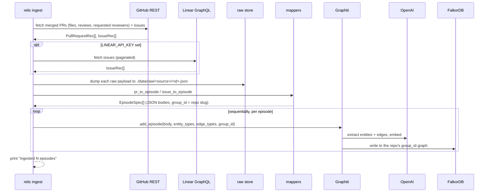

# Ingestion (capture)

`relic ingest --repo owner/name` is the capture pipeline. It pulls engineering
history from GitHub (and optionally Linear), keeps a raw copy, turns each item
into a typed episode, and lands those episodes in the graph. The path from source
payload to episode is fully deterministic: no LLM, no guessing. The LLM enters
only at the Graphiti extraction step.

Orchestration lives in [`_ingest`](../src/relic/cli.py). The pieces are in
[`ingest/`](../src/relic/ingest/) and [`graph/load.py`](../src/relic/graph/load.py).

## The flow

## Step 1: fetch from GitHub

[`github.py`](../src/relic/ingest/github.py) is an async connector over
`githubkit`.

**Token.** `resolve_github_token` uses `GITHUB_TOKEN` if set, otherwise shells
out to `gh auth token`. With neither it raises a clear error.

**Merged PRs.** `fetch_repo` paginates closed PRs and keeps the ones with a
`merged_at`. With `--limit N` it stops after N merged PRs, most recent first. Each
kept PR is hydrated concurrently, bounded by an `asyncio.Semaphore` set to
`SEMAPHORE_LIMIT`. Hydration (`_fetch_pr_detail`) pulls:

- changed files (path, additions, deletions, status),
- reviews (reviewer login and profile URL, state, timestamp, URL, body),
- requested reviewers.

**Issues.** `_fetch_issues` paginates all issues and skips the ones that are
actually PRs (the issues endpoint returns both). It captures assignees and labels.
`--limit` caps the count.

Everything is normalized to the record dataclasses in `mappers.py`
(`PullRequestRec`, `ReviewRec`, `FileChange`, `IssueRec`) and bundled into a
`RepoBundle`. The original payload is kept on each record's `raw` field for the
raw store.

## Step 2: fetch from Linear (optional)

[`linear.py`](../src/relic/ingest/linear.py) is a GraphQL connector over `gql`,
guarded behind `LINEAR_API_KEY`. `fetch_issues` paginates all issues (identifier,
title, url, state, assignee, labels, created and completed timestamps) and maps
each to the same `IssueRec` used for GitHub issues, with `source="linear"`. When
the key is unset, `ingest` prints that Linear was skipped and moves on.

## Step 3: keep a raw copy

[`raw_store.py`](../src/relic/ingest/raw_store.py) writes every fetched payload to
`./data/raw/<source>/<id>.json` before anything else touches it. PRs are stored as
`pr-<number>.json`, issues by a filesystem-safe form of their identifier. This is
the immutable artifact a compiled skill can cite. It becomes object storage (R2)
later.

## Step 4: map to episodes

[`mappers.py`](../src/relic/ingest/mappers.py) is pure and unit-tested: no
network, no LLM. It turns each record into an `EpisodeSpec`.

- `pr_to_episode` builds the PR episode body (repo, pull_request, reviews,
  requested_reviewers, files), names it `PR <repo>#<number>`, and sets
  `reference_time` to the merge time (falling back to creation).
- `issue_to_episode` builds the issue body and names it `Issue <identifier>`.
- `repo_group_id` slugifies `owner/name` to a Graphiti-legal `group_id`: `/`
  becomes `__`, and any other non-`[A-Za-z0-9_-]` character becomes `_`. For
  example `buildrelic/relic-core` becomes `buildrelic__relic-core`.
- `_clip` trims descriptions and review comments to 4000 characters and drops
  empty bodies to null, so the PR body informs extraction without blowing up
  per-episode token cost.

The episode JSON keys mirror the flat `*Node` attributes (see
[data-model.md](data-model.md)) so the extractor maps them onto typed entities.

## Step 5: land in the graph

[`load.py`](../src/relic/graph/load.py) adds episodes to Graphiti.

- It first calls `ensure_indexes` (`build_indices_and_constraints`), so indexes
  exist before the first episode.
- It adds episodes **sequentially**, awaiting each before the next. This matters:
  an entity extracted from PR 1 must be resolvable when PR 2's reviewer references
  the same person. Parallel adds would fork the same person into duplicates.
- Each `add_episode` passes `entity_types`, `edge_types`, `edge_type_map`, and the
  episode's `group_id`. Graphiti routes the write to the FalkorDB graph named by
  that `group_id`, partitioning the graph per repo (see
  [memory-and-recall.md](memory-and-recall.md)).
- A `rich` progress bar tracks the loop.

The engram client for ingestion is built by `make_engram` with the default
`FALKORDB_DATABASE` and `max_coroutines=SEMAPHORE_LIMIT`. It is always closed in a
`finally` so the connection does not leak.

## Cost control

The "12 months of history in an afternoon" claim rides on not re-deriving what the
API already gives you.

- **Deterministic mapping.** The connectors and mappers do the structural work;
  the LLM only extracts and embeds.
- **Bounded entity types.** Passing `entity_types` and `edge_types` keeps the
  extractor from inventing a wide schema.
- **`--limit`.** Bounds the first run on a large repo.
- **Clipped bodies.** 4000-character cap per description.
- **`gpt-4o-mini`.** The cheap model does extraction and reranking.

## Re-ingesting

Re-running `ingest` is additive: Graphiti generates episode uuids, so the same PR
ingested twice lands as two episodes. To reload a repo clean, clear that repo's
graph in FalkorDB first (the per-`group_id` graph). The raw store overwrites by
id, so it stays a single current copy per item.

## What is verified

The deterministic fetch, map, and raw-store path is unit-tested
([`test_github_ingest`-style tests](../tests/test_ingest_integration.py),
[`test_mappers.py`](../tests/test_mappers.py),
[`test_raw_store.py`](../tests/test_raw_store.py)). The live Graphiti load plus
semantic recall has been run end to end against real repos and returns real people
with facts, profile URLs, and source-episode provenance.
