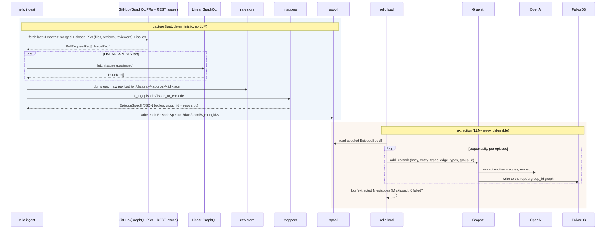

`relic ingest --repo owner/name` is the capture pipeline. It pulls engineering
history from GitHub (and optionally Linear), keeps a raw copy, turns each item
into a typed episode, spools those episodes to disk, and lands them in the graph.
The path from source payload to episode is fully deterministic: no LLM, no
guessing. The LLM enters only at the Graphiti extraction step.

That extraction is almost the whole clock: a 40-episode run on `astral-sh/uv`
spent 99.5% of its time there, against 0.4% on the GitHub fetch. So the pipeline
splits at the spool into two halves you can run separately:

- **Capture** (fetch, map, raw store, spool) is fast and deterministic. No LLM, no
  graph. `relic ingest --no-load` runs only this and stops.
- **Extraction** (`relic load`) reads the spool and lands episodes in the graph.
  This is the LLM-heavy half. Run it right after capture, on a schedule, or one
  batch at a time with `--limit`.

The default `relic ingest` runs both halves back to back, so the split is opt-in.

Orchestration lives in [`_ingest`](https://github.com/buildrelic/relic-core/blob/main/packages/relic-cli/src/relic/cli.py) and [`_load`](https://github.com/buildrelic/relic-core/blob/main/packages/relic-cli/src/relic/cli.py). The pieces are in
[`ingest/`](https://github.com/buildrelic/relic-core/tree/main/packages/relic-ingest/src/relic/ingest/) and [`graph/load.py`](https://github.com/buildrelic/relic-core/blob/main/packages/relic-graph/src/relic/graph/load.py).

## The flow



The default `relic ingest` runs both rects in one process. `relic ingest --no-load`
stops after the spool; `relic load --repo owner/name` runs the second rect later.

## Step 1: fetch from GitHub

[`github.py`](https://github.com/buildrelic/relic-core/blob/main/packages/relic-ingest/src/relic/ingest/github.py) is an async connector over
`githubkit`. The fetch is windowed to the last `--months` (default 12) so the
first run on a large repo does not page its entire history.

**Token.** `resolve_github_token` uses `GITHUB_TOKEN` if set, otherwise shells
out to `gh auth token`. With neither it raises a clear error.

**Merged and closed PRs.** `_fetch_prs_graphql` pulls PRs in a terminal state (merged or closed without merge) with one batched GraphQL query per page: each page returns PRs ordered by `updatedAt` descending, every PR carrying its files (with `additions`/`deletions`), reviews, requested reviewers (with the `__typename` that separates a user request from a team request), labels, commit authors and messages, PR-level diff stats, base/head branch, and the issues it closes (`closingIssuesReferences`) in the same round trip, so there is no per-PR REST fan-out. These are the review-routing signals: who a PR was sent to, who actually reviewed, what area it touched, and which issue it resolved. Paging stops once a PR's `updatedAt` falls before the cutoff. The skip test keys off the terminal event, `mergedAt` or else `closedAt`: a PR whose terminal time predates the window is skipped even if a later comment bumped `updatedAt` into it. `--limit N` caps the count, most recent first.

**Issues.** `_fetch_issues` uses the REST list endpoint with its native `since`
filter (issues updated at or after the cutoff), skipping the ones that are actually
PRs (the issues endpoint returns both). It captures assignees and labels; `--limit`
caps the count.

Each GraphQL node is parsed by the pure `_pr_node_to_rec` into the same record
dataclasses in `mappers.py` (`PullRequestRec`, `ReviewRec`, `FileChange`,
`IssueRec`) the REST path produced, bundled into a `RepoBundle`. The original
payload is kept on each record's `raw` field for the raw store.

## Step 2: fetch from Linear (optional)

[`linear.py`](https://github.com/buildrelic/relic-core/blob/main/packages/relic-ingest/src/relic/ingest/linear.py) is a GraphQL connector over `gql`,
guarded behind `LINEAR_API_KEY`. `fetch_issues` paginates all issues (identifier,
title, description, url, state, assignee, labels, parent, created and completed
timestamps) and maps each to the same `IssueRec` used for GitHub issues, with
`source="linear"`. The description was previously not even queried, so every Linear
episode used to land with a null body; it now carries the issue's substance. When
the key is unset, `ingest` logs that Linear was skipped and moves on.

## Step 3: keep a raw copy

[`raw_store.py`](https://github.com/buildrelic/relic-core/blob/main/packages/relic-ingest/src/relic/ingest/raw_store.py) writes every fetched payload to
`./data/raw/<source>/<id>.json` before anything else touches it. PRs are stored as
`pr-<number>.json`, issues by a filesystem-safe form of their identifier. This is
the immutable artifact a compiled skill can cite. It becomes object storage (R2)
later.

## Step 4: map to episodes

[`mappers.py`](https://github.com/buildrelic/relic-core/blob/main/packages/relic-ingest/src/relic/ingest/mappers.py) is pure and unit-tested: no
network, no LLM. It turns each record into an `EpisodeSpec` whose body is a typed,
versioned model from
[`relic.contracts.episode_body`](https://github.com/buildrelic/relic-core/blob/main/packages/relic-core/src/relic/contracts/episode_body.py)
(see [Data model](/data-model) for the full shape and invariants).

- `pr_to_episode` maps a PR in any state, builds a `PrEpisodeBody` (repo, pull_request, reviews, requested_reviewers with `kind`, files with per-file stats, commits, linked_issues, derived timestamps, diff stats, labels), names it `PR <repo>#<number>`, and anchors `reference_time` to the merge time, falling back to the creation time, then to the epoch if both are missing.
- `issue_to_episode` builds an `IssueEpisodeBody` and names it `Issue <identifier>`.
- `_pr_timestamps` derives `first_review_at`, `approved_at`, and `time_to_merge_hours` from the reviews and PR times, with no extra fetch. These are stable because a PR is ingested only at a terminal state.
- `repo_group_id` slugifies `owner/name` to a Graphiti-legal `group_id`: `/`
  becomes `__`, and any other non-`[A-Za-z0-9_-]` character becomes `_`. For
  example `buildrelic/relic-core` becomes `buildrelic__relic-core`.
- `_clip` trims free text per field (description 2000 chars, review comment 1500,
  commit message 1000, dropping empty bodies to null), `_select_reviews` drops bot
  reviews and caps human reviews (keeping decided states and the most recent), and
  `_fit_budget` trims the assembled body to a per-episode token budget. Oversized
  JSON episodes degrade extraction, so the body is bounded rather than left to grow.

The episode body keys mirror the flat `*Node` attributes so the extractor maps them
onto typed entities. Several fields are richer than the entity/edge schema consumes
today; they are the agreed target the graph side adds types for (see the note in
[Data model](/data-model)).

## Step 5: spool the episodes

[`spool.py`](https://github.com/buildrelic/relic-core/blob/main/packages/relic-ingest/src/relic/ingest/spool.py) writes each mapped `EpisodeSpec` to
`./data/spool/<group_id>/<slug>-<hash>.json` before extraction runs. This is the
artifact that decouples the fast capture from the slow LLM load: capture ends here,
and `relic load` starts here.

- **One file per episode.** A re-capture upserts by episode name (same name, same
  filename) instead of appending a duplicate, so the spool stays a current snapshot
  of what was captured. The `<hash>` (first 8 hex of the name's sha256) keeps the
  filename unique even when two names slugify alike.
- **Grouped by capture key.** Files land under the GitHub repo's `group_id`, the same
  key the checkpoint uses. A Linear episode pulled in the same run spools there too,
  but keeps its own `group_id` inside the record, so the loader still partitions it
  into the Linear graph.
- **Drained by the checkpoint, not by deletion.** `relic load` skips episodes the
  checkpoint already records, so the spool is re-runnable: load it twice and the
  second run is a no-op. The default `relic ingest` writes the spool and then loads
  from the same in-memory list in one process.

## Step 6: land in the graph

[`load.py`](https://github.com/buildrelic/relic-core/blob/main/packages/relic-graph/src/relic/graph/load.py) adds episodes to Graphiti.

- It first calls `ensure_indexes` (`build_indices_and_constraints`), so indexes
  exist before the first episode.
- It adds episodes **sequentially**, awaiting each before the next. This matters:
  an entity extracted from PR 1 must be resolvable when PR 2's reviewer references
  the same person. Parallel adds would fork the same person into duplicates.
- `--bulk` (`load_episodes_bulk`) is the faster backfill path: it routes through
  Graphiti's `add_episode_bulk`, extracting a whole batch in parallel and deduping
  once. Episodes are grouped by `group_id` (bulk binds one graph per call), chunked,
  and checkpointed per batch; a failed batch falls back to per-episode adds so the
  resilience guarantee holds. Sequential remains the default until eval confirms
  recall parity.
- Each `add_episode` passes `entity_types`, `edge_types`, `edge_type_map`, and the
  episode's `group_id`. Graphiti routes the write to the FalkorDB graph named by
  that `group_id`, partitioning the graph per repo (see
  [Memory and recall](/memory-and-recall)).
- The loop is **resilient**: one episode that fails extraction (a rate limit, a
  malformed entity) is caught, counted, and logged, and the run carries on. A
  single bad PR never aborts the whole ingest.
- It returns `LoadStats`: `loaded`, `skipped`, `failed`, the list of failures, and
  the wall-clock duration. The CLI logs a one-line summary from it.

The engram client for ingestion is built by `make_engram` with the default
`FALKORDB_DATABASE` and `max_coroutines=GRAPHITI_MAX_COROUTINES`. It is always
closed in a `finally` so the connection does not leak. `make_engram` also applies
two compatibility monkeypatches to graphiti-core 0.29.1: one fixes the FalkorDB
fulltext query builders (it returns an empty query when the text sanitizes to
nothing, and escapes hyphens in `group_id` filters so RediSearch does not read them
as negation), the other makes the prompt JSON serializer (`to_prompt_json`)
tolerate `datetime` values. Without it, `add_episode_bulk` raises `TypeError:
Object of type datetime is not JSON serializable` and falls back to slow
per-episode loading (seen with the Gemini provider, which populates node
timestamps). Both are documented in [`engram.py`](https://github.com/buildrelic/relic-core/blob/main/packages/relic-graph/src/relic/graph/engram.py).

<Note>
Before extraction, `ingest` runs a fast TCP probe (`falkordb_reachable`). If the
graph is down it stops with one line (`FalkorDB not reachable at ...`) and a
non-zero exit, before spending a single GitHub or OpenAI call. `--no-load` skips the
probe entirely: a capture-only run needs no graph.
</Note>

## Running capture and load separately

The split exists because extraction dominates the clock. Capture is a few seconds;
extraction is minutes-to-hours, ~6 to 8 LLM calls per episode, strictly sequential.
Pulling them apart lets each run on its own cadence.

<Steps>
  <Step title="Capture: no graph or OpenAI key needed">
    ```bash
    uv run relic ingest --repo astral-sh/uv --no-load
    ```
    Fetches, maps, and spools episodes, then stops. Fast and deterministic.
  </Step>
  <Step title="Extract on demand, a batch at a time">
    ```bash
    uv run relic load --repo astral-sh/uv --limit 10
    ```
    Drains 10 spooled episodes into the graph. Re-run to drain more.
  </Step>
  <Step title="Drain the rest">
    ```bash
    uv run relic load --repo astral-sh/uv
    ```
  </Step>
</Steps>

`relic load` reads the spool, not the network, so it needs `OPENAI_API_KEY` and a
running FalkorDB but no GitHub token. `--limit N` extracts at most N not-yet-loaded
episodes for case-by-case loading; re-run to drain more. It shares the checkpoint
with `ingest`, so capture-then-load and the combined `ingest` land identical graphs,
and a `load` re-run only extracts what is new. This is the seam an async worker or a
nightly job hangs off: capture on every push, extract on a budget.

## Cost control

The "12 months of history in an afternoon" claim rides on not re-deriving what the
API already gives you.

- **Deterministic mapping.** The connectors and mappers do the structural work;
  the LLM only extracts and embeds.
- **Bounded entity types.** Passing `entity_types` and `edge_types` keeps the
  extractor from inventing a wide schema.
- **`--months` and `--limit`.** The window bounds the fetch to recent history;
  `--limit` further caps the count on a large repo.
- **Batched GraphQL fetch.** One query per page hydrates many PRs at once, instead
  of three-plus REST calls per PR.
- **Clipped, pruned episodes.** 2000-character cap per description; bot reviews
  dropped and human reviews capped per PR.
- **`--bulk`.** Batched loading via `add_episode_bulk` for a faster backfill.
- **`gpt-4o-mini`.** The cheap model does extraction and reranking.

## Resumability and re-ingesting

Graphiti mints a fresh uuid per `add_episode`, so the same PR added twice would
land as two episodes. A checkpoint stops that.

[`checkpoint.py`](https://github.com/buildrelic/relic-core/blob/main/packages/relic-ingest/src/relic/ingest/checkpoint.py) keeps a per-repo ledger of the
episodes that have landed, at `./data/ingest/<group_id>.log`, one episode name per
line. The name (`PR owner/name#42`, `Issue REL-10`) is deterministic and unique
per item. `load_episodes` skips any episode already in the ledger and appends each
new one as it lands, flushing per line.

Two things fall out of this:

- **Resume.** A run cut short by a rate limit or a crash picks up where it left
  off. The episodes already landed are skipped, not re-paid for and not
  duplicated. The summary reports the skipped count.
- **Re-run is cheap and idempotent.** Re-running `ingest` on the same repo loads
  only what is new since last time.

<Warning>
To reload a repo from scratch, pass `--fresh`: it clears the checkpoint so every
episode is added again. Clearing the checkpoint and clearing the repo's graph go
together. Drop the per-`group_id` graph in FalkorDB first (see the `just
reset-graph` note), or you will get duplicates. The raw store overwrites by id, so
it stays a single current copy per item regardless.
</Warning>

## Observability

Logs are diagnostics, so they go to **stderr**. stdout stays clean for piping. The
result of `ingest` is the populated graph, not its console output.

- **Counts and timing.** `ingest` logs the fetch counts and how long the fetch
  took, whether Linear ran, and a final summary: episodes loaded, skipped, and
  failed, with the wall-clock duration.
- **Phase timing.** A full `ingest` ends with a compact timing block on stderr:
  fetch, map + raw store + spool, load (extraction), and setup + index, each with
  its share of the total, plus the per-episode load rate. It makes the LLM-bound
  shape obvious at a glance: the load phase is almost the whole clock. `relic load`
  prints the same block over its own phases (read spool, load, setup + index), and a
  `--no-load` capture logs one line with the fetch and map + spool times.
- **Failures.** Each failed episode logs one `WARNING` line with its name and the
  error. A run that loads nothing but hits failures exits non-zero. A whole-run
  failure (no token, graph down, bad key) logs one `ERROR` line, not a traceback.
- **Verbose.** `relic --verbose ingest ...` (or `-v`) drops the level to `DEBUG`:
  per-episode tracebacks, the raw-payload count, and any background-task errors.
- **Quiet by default.** Logging attaches to the `relic` logger only, so
  graphiti/httpx/openai `INFO` chatter stays suppressed unless you ask for it
  ([`obs.py`](https://github.com/buildrelic/relic-core/blob/main/packages/relic-core/src/relic/obs.py)).

## What is verified

The deterministic fetch, map, and raw-store path is unit-tested
([`test_github_ingest`-style tests](https://github.com/buildrelic/relic-core/blob/main/tests/test_ingest_integration.py),
[`test_mappers.py`](https://github.com/buildrelic/relic-core/blob/main/tests/test_mappers.py),
[`test_raw_store.py`](https://github.com/buildrelic/relic-core/blob/main/tests/test_raw_store.py)). The live Graphiti load plus
semantic recall has been run end to end against real repos and returns real people
with facts, profile URLs, and source-episode provenance.
