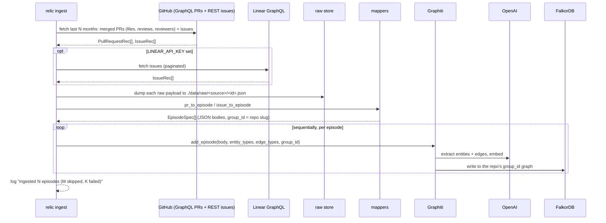

`relic ingest --repo owner/name` is the capture pipeline. It pulls engineering
history from GitHub (and optionally Linear), keeps a raw copy, turns each item
into a typed episode, and lands those episodes in the graph. The path from source
payload to episode is fully deterministic: no LLM, no guessing. The LLM enters
only at the Graphiti extraction step.

Orchestration lives in [`_ingest`](../src/relic/cli.py). The pieces are in
[`ingest/`](../src/relic/ingest/) and [`graph/load.py`](../src/relic/graph/load.py).

## The flow

## Step 1: fetch from GitHub

[`github.py`](../src/relic/ingest/github.py) is an async connector over
`githubkit`. The fetch is windowed to the last `--months` (default 12) so the
first run on a large repo does not page its entire history.

**Token.** `resolve_github_token` uses `GITHUB_TOKEN` if set, otherwise shells
out to `gh auth token`. With neither it raises a clear error.

**Merged PRs.** `_fetch_prs_graphql` pulls merged PRs with one batched GraphQL
query per page — each page returns PRs ordered by `updatedAt` descending, every PR
carrying its files, reviews, and requested reviewers in the same round trip, so
there is no per-PR REST fan-out. Paging stops once a PR's `updatedAt` falls before
the cutoff (a PR merged in-window must have `updatedAt >= mergedAt >= cutoff`); a
PR updated in-window but merged earlier is skipped. `--limit N` caps the count,
most recent first.

**Issues.** `_fetch_issues` uses the REST list endpoint with its native `since`
filter (issues updated at or after the cutoff), skipping the ones that are actually
PRs (the issues endpoint returns both). It captures assignees and labels; `--limit`
caps the count.

Each GraphQL node is parsed by the pure `_pr_node_to_rec` into the same record
dataclasses in `mappers.py` (`PullRequestRec`, `ReviewRec`, `FileChange`,
`IssueRec`) the REST path produced, bundled into a `RepoBundle`. The original
payload is kept on each record's `raw` field for the raw store.

## Step 2: fetch from Linear (optional)

[`linear.py`](../src/relic/ingest/linear.py) is a GraphQL connector over `gql`,
guarded behind `LINEAR_API_KEY`. `fetch_issues` paginates all issues (identifier,
title, url, state, assignee, labels, created and completed timestamps) and maps
each to the same `IssueRec` used for GitHub issues, with `source="linear"`. When
the key is unset, `ingest` logs that Linear was skipped and moves on.

## Step 3: keep a raw copy

[`raw_store.py`](../src/relic/ingest/raw_store.py) writes every fetched payload to
`./data/raw/<source>/<id>.json` before anything else touches it. PRs are stored as
`pr-<number>.json`, issues by a filesystem-safe form of their identifier. This is
the immutable artifact a compiled skill can cite. It becomes object storage (R2)
later.

## Step 4: map to episodes

[`mappers.py`](../src/relic/ingest/mappers.py) is pure and unit-tested: no
network, no LLM. It turns each record into an `EpisodeSpec`.

- `pr_to_episode` builds the PR episode body (repo, pull_request, reviews,
  requested_reviewers, files), names it `PR <repo>#<number>`, and sets
  `reference_time` to the merge time (falling back to creation).
- `issue_to_episode` builds the issue body and names it `Issue <identifier>`.
- `repo_group_id` slugifies `owner/name` to a Graphiti-legal `group_id`: `/`
  becomes `__`, and any other non-`[A-Za-z0-9_-]` character becomes `_`. For
  example `buildrelic/relic-core` becomes `buildrelic__relic-core`.
- `_clip` trims descriptions and review comments to 2000 characters (dropping
  empty bodies to null), and `_select_reviews` drops bot reviews and caps the
  number of human reviews per PR (keeping decided states and the most recent), so
  the PR informs extraction without blowing up per-episode token cost.

The episode JSON keys mirror the flat `*Node` attributes (see
[data-model.md](data-model.md)) so the extractor maps them onto typed entities.

## Step 5: land in the graph

[`load.py`](../src/relic/graph/load.py) adds episodes to Graphiti.

- It first calls `ensure_indexes` (`build_indices_and_constraints`), so indexes
  exist before the first episode.
- It adds episodes **sequentially**, awaiting each before the next. This matters:
  an entity extracted from PR 1 must be resolvable when PR 2's reviewer references
  the same person. Parallel adds would fork the same person into duplicates.
- `--bulk` (`load_episodes_bulk`) is the faster backfill path: it routes through
  Graphiti's `add_episode_bulk`, extracting a whole batch in parallel and deduping
  once. Episodes are grouped by `group_id` (bulk binds one graph per call), chunked,
  and checkpointed per batch; a failed batch falls back to per-episode adds so the
  resilience guarantee holds. Sequential remains the default until eval confirms
  recall parity.
- Each `add_episode` passes `entity_types`, `edge_types`, `edge_type_map`, and the
  episode's `group_id`. Graphiti routes the write to the FalkorDB graph named by
  that `group_id`, partitioning the graph per repo (see
  [memory-and-recall.md](memory-and-recall.md)).
- The loop is **resilient**: one episode that fails extraction (a rate limit, a
  malformed entity) is caught, counted, and logged, and the run carries on. A
  single bad PR never aborts the whole ingest.
- It returns `LoadStats`: `loaded`, `skipped`, `failed`, the list of failures, and
  the wall-clock duration. The CLI logs a one-line summary from it.

The engram client for ingestion is built by `make_engram` with the default
`FALKORDB_DATABASE` and `max_coroutines=GRAPHITI_MAX_COROUTINES`. It is always
closed in a `finally` so the connection does not leak. `make_engram` also applies
two compatibility monkeypatches to graphiti-core 0.29.1: one guards an empty
FalkorDB fulltext query, the other makes the prompt JSON serializer
(`to_prompt_json`) tolerate `datetime` values — without it, `add_episode_bulk`
raises `TypeError: Object of type datetime is not JSON serializable` and falls back
to slow per-episode loading (seen with the Gemini provider, which populates edge
timestamps). Both are documented in [`engram.py`](../src/relic/graph/engram.py).

<Note>
Before any of this, `ingest` runs a fast TCP probe (`falkordb_reachable`). If the
graph is down it stops with one line (`FalkorDB not reachable at ...`) and a
non-zero exit, before spending a single GitHub or OpenAI call.
</Note>

## Cost control

The "12 months of history in an afternoon" claim rides on not re-deriving what the
API already gives you.

- **Deterministic mapping.** The connectors and mappers do the structural work;
  the LLM only extracts and embeds.
- **Bounded entity types.** Passing `entity_types` and `edge_types` keeps the
  extractor from inventing a wide schema.
- **`--months` and `--limit`.** The window bounds the fetch to recent history;
  `--limit` further caps the count on a large repo.
- **Batched GraphQL fetch.** One query per page hydrates many PRs at once, instead
  of three-plus REST calls per PR.
- **Clipped, pruned episodes.** 2000-character cap per description; bot reviews
  dropped and human reviews capped per PR.
- **`--bulk`.** Batched loading via `add_episode_bulk` for a faster backfill.
- **`gpt-4o-mini`.** The cheap model does extraction and reranking.

## Resumability and re-ingesting

Graphiti mints a fresh uuid per `add_episode`, so the same PR added twice would
land as two episodes. A checkpoint stops that.

[`checkpoint.py`](../src/relic/ingest/checkpoint.py) keeps a per-repo ledger of the
episodes that have landed, at `./data/ingest/<group_id>.log`, one episode name per
line. The name (`PR owner/name#42`, `Issue REL-10`) is deterministic and unique
per item. `load_episodes` skips any episode already in the ledger and appends each
new one as it lands, flushing per line.

Two things fall out of this:

- **Resume.** A run cut short by a rate limit or a crash picks up where it left
  off. The episodes already landed are skipped, not re-paid for and not
  duplicated. The summary reports the skipped count.
- **Re-run is cheap and idempotent.** Re-running `ingest` on the same repo loads
  only what is new since last time.

<Warning>
To reload a repo from scratch, pass `--fresh`: it clears the checkpoint so every
episode is added again. Clearing the checkpoint and clearing the repo's graph go
together. Drop the per-`group_id` graph in FalkorDB first (see the `just
reset-graph` note), or you will get duplicates. The raw store overwrites by id, so
it stays a single current copy per item regardless.
</Warning>

## Observability

Logs are diagnostics, so they go to **stderr**. stdout stays clean for piping. The
result of `ingest` is the populated graph, not its console output.

- **Counts and timing.** `ingest` logs the fetch counts and how long the fetch
  took, whether Linear ran, and a final summary: episodes loaded, skipped, and
  failed, with the wall-clock duration.
- **Failures.** Each failed episode logs one `WARNING` line with its name and the
  error. A run that loads nothing but hits failures exits non-zero. A whole-run
  failure (no token, graph down, bad key) logs one `ERROR` line, not a traceback.
- **Verbose.** `relic --verbose ingest ...` (or `-v`) drops the level to `DEBUG`:
  per-episode tracebacks, the raw-payload count, and any background-task errors.
- **Quiet by default.** Logging attaches to the `relic` logger only, so
  graphiti/httpx/openai `INFO` chatter stays suppressed unless you ask for it
  ([`obs.py`](../src/relic/obs.py)).

## What is verified

The deterministic fetch, map, and raw-store path is unit-tested
([`test_github_ingest`-style tests](../tests/test_ingest_integration.py),
[`test_mappers.py`](../tests/test_mappers.py),
[`test_raw_store.py`](../tests/test_raw_store.py)). The live Graphiti load plus
semantic recall has been run end to end against real repos and returns real people
with facts, profile URLs, and source-episode provenance.
