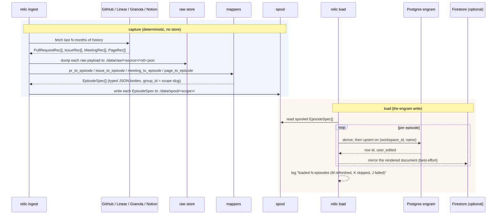

`relic ingest` is the capture pipeline. It pulls history from a source, keeps a
raw copy, turns each item into a typed episode, spools those episodes to disk,
and lands them in the engram store. The whole path is deterministic: no LLM
anywhere, from source payload to Postgres row (ADR-0007).

Four sources are wired:

- **GitHub** (`--repo owner/name`, the default source): merged and closed PRs
  with reviews and files, plus issues. Pulls Linear issues in the same run when
  `LINEAR_API_KEY` is set.
- **Granola** (`--source granola`): meetings, scoped per note owner
  (`granola__<email>`).
- **Notion** (`--source notion`): pages, scoped per workspace
  (`notion__<workspace>`).
- **Claude Code sessions**: captured by the daemon's `capture` route, not by
  `relic ingest`; the mapper (`session_to_episode`) and loader are the same.

The pipeline splits at the spool into two halves you can run separately:

- **Capture** (fetch, map, raw store, spool) needs the source credential but no
  store. `relic ingest --no-load` runs only this and stops.
- **Load** (`relic load`) reads the spool and lands episodes in the engram: one
  Postgres upsert per episode, milliseconds each. Run it right after capture, on
  a schedule, or one batch at a time with `--limit`.

The default `relic ingest` runs both halves back to back, so the split is opt-in.
In the graph era the split existed because LLM extraction dominated the clock at
99.5 percent; the extraction step is gone, and the split survives because the
two-phase workflow (capture on every push, load on a budget) is still the seam a
webhook or a cron hangs off.

Orchestration lives in [`_ingest`](https://github.com/buildrelic/relic-core/blob/main/packages/relic-cli/src/relic/cli.py) and [`_load`](https://github.com/buildrelic/relic-core/blob/main/packages/relic-cli/src/relic/cli.py). The pieces are in
[`ingest/`](https://github.com/buildrelic/relic-core/tree/main/packages/relic-ingest/src/relic/ingest/) and [`engram/load.py`](https://github.com/buildrelic/relic-core/blob/main/packages/relic-engram/src/relic/engram/load.py).

## The flow



The default `relic ingest` runs both rects in one process. `relic ingest --no-load`
stops after the spool; `relic load` runs the second rect later.

## Step 1: fetch from GitHub

[`github.py`](https://github.com/buildrelic/relic-core/blob/main/packages/relic-ingest/src/relic/ingest/github.py) is an async connector over
`githubkit`. The fetch is windowed to the last `--months` (default 12) so the
first run on a large repo does not page its entire history.

**Token.** `resolve_github_token` uses `GITHUB_TOKEN` if set, otherwise shells
out to `gh auth token`. With neither it raises a clear error.

**Merged and closed PRs.** `_fetch_prs_graphql` pulls PRs in a terminal state (merged or closed without merge) with one batched GraphQL query per page: each page returns PRs ordered by `updatedAt` descending, every PR carrying its files (with `additions`/`deletions`), reviews, requested reviewers (with the `__typename` that separates a user request from a team request), labels, commit authors and messages, PR-level diff stats, base/head branch, and the issues it closes (`closingIssuesReferences`) in the same round trip, so there is no per-PR REST fan-out. These are the review-routing signals: who a PR was sent to, who actually reviewed, what area it touched, and which issue it resolved. Paging stops once a PR's `updatedAt` falls before the cutoff. The skip test keys off the terminal event, `mergedAt` or else `closedAt`: a PR whose terminal time predates the window is skipped even if a later comment bumped `updatedAt` into it. `--limit N` caps the count, most recent first.

**Issues.** `_fetch_issues` uses the REST list endpoint with its native `since`
filter (issues updated at or after the cutoff), skipping the ones that are actually
PRs (the issues endpoint returns both). It captures assignees and labels; `--limit`
caps the count.

Each GraphQL node is parsed by the pure `_pr_node_to_rec` into the same record
dataclasses in `mappers.py` (`PullRequestRec`, `ReviewRec`, `FileChange`,
`IssueRec`) the REST path produced, bundled into a `RepoBundle`. The original
payload is kept on each record's `raw` field for the raw store.

## Step 2: fetch from Linear (optional)

[`linear.py`](https://github.com/buildrelic/relic-core/blob/main/packages/relic-ingest/src/relic/ingest/linear.py) is a GraphQL connector over `gql`,
guarded behind `LINEAR_API_KEY`. `fetch_issues` paginates all issues (identifier,
title, description, url, state, assignee, labels, parent, created and completed
timestamps) and maps each to the same `IssueRec` used for GitHub issues, with
`source="linear"`. When the key is unset, `ingest` logs that Linear was skipped
and moves on. Linear episodes ride a github ingest: they spool under the repo's
capture key but keep their own scope inside the record.

## Steps 1 and 2 for the non-repo sources

**Granola.** `relic ingest --source granola` fetches meetings with the `grn_`
key (`GRANOLA_API_KEY`, or a per-user key forwarded by the web app's
`POST /v1/ingest`). Each meeting maps to a `ConversationEpisodeBody`
(participants, summary, decisions, transcript) named `Meeting <id>`, scoped by
its note owner (`granola__<email>`), since one key can return notes owned by
different people. Each owner scope gets its own spool directory and checkpoint.

**Notion.** `relic ingest --source notion` fetches pages with an internal
integration token (`NOTION_API_KEY`, or forwarded per user); only pages shared
with the integration are visible. Each page maps to a `DocEpisodeBody` (title,
url, authors, text) named `Notion <id>`, scoped by its workspace
(`notion__<workspace>`), on the same per-scope spool and checkpoint path as
Granola.

**Sessions.** The daemon's `capture` route turns a finished Claude Code session
into an `AgentSessionEpisodeBody` (actor, cwd, files touched, summary, a
distilled transcript) via `session_to_episode`, and lands it through the same
loader, scoped to the repo the session ran in.

## Step 3: keep a raw copy

[`raw_store.py`](https://github.com/buildrelic/relic-core/blob/main/packages/relic-ingest/src/relic/ingest/raw_store.py) writes every fetched payload to
`./data/raw/<source>/<id>.json` before anything else touches it. PRs are stored as
`pr-<number>.json`, issues by a filesystem-safe form of their identifier. This is
the immutable artifact a compiled skill can cite. It becomes object storage (R2)
later.

## Step 4: map to episodes

[`mappers.py`](https://github.com/buildrelic/relic-core/blob/main/packages/relic-ingest/src/relic/ingest/mappers.py) is pure and unit-tested: no
network, no LLM. It turns each record into an `EpisodeSpec` whose body is a typed,
versioned model from
[`relic.contracts.episode_body`](https://github.com/buildrelic/relic-core/blob/main/packages/relic-core/src/relic/contracts/episode_body.py)
(see [Data model](/data-model) for the full shape and invariants).

- `pr_to_episode` maps a PR in any state, builds a `PrEpisodeBody` (repo, pull_request, reviews, requested_reviewers with `kind`, files with per-file stats, commits, linked_issues, derived timestamps, diff stats, labels), names it `PR <repo>#<number>`, and anchors `reference_time` to the merge time, falling back to the creation time, then to the epoch if both are missing.
- `issue_to_episode` builds an `IssueEpisodeBody` and names it `Issue <identifier>`.
- `meeting_to_episode` and `page_to_episode` build the conversation and doc
  bodies for Granola and Notion; `session_to_episode` builds the agent-session
  body for the daemon.
- `_pr_timestamps` derives `first_review_at`, `approved_at`, and `time_to_merge_hours` from the reviews and PR times, with no extra fetch. These are stable because a PR is ingested only at a terminal state.
- `repo_group_id` slugifies `owner/name` into the scope slug: `/` becomes `__`,
  and any other non-`[A-Za-z0-9_-]` character becomes `_`. For example
  `buildrelic/relic-core` becomes `buildrelic__relic-core`. The slug lands on the
  row's `scope` column.
- `_clip` trims free text per field (description 2000 chars, review comment 1500,
  commit message 1000, dropping empty bodies to null), `_select_reviews` drops bot
  reviews and caps human reviews (keeping decided states and the most recent), and
  `_fit_budget` trims the assembled body to a per-episode budget, so a
  pathological artifact cannot bloat its row.

The engram side reads the same typed body: `derive` turns it into the row's
title, url, search text, markdown, people, and paths (see
[Memory and recall](/memory-and-recall)).

## Step 5: spool the episodes

[`spool.py`](https://github.com/buildrelic/relic-core/blob/main/packages/relic-ingest/src/relic/ingest/spool.py) writes each mapped `EpisodeSpec` to
`./data/spool/<scope>/<slug>-<hash>.json` before the load runs. This is the
artifact that decouples capture from the engram write: capture ends here, and
`relic load` starts here.

- **One file per episode.** A re-capture upserts by episode name (same name, same
  filename) instead of appending a duplicate, so the spool stays a current snapshot
  of what was captured. The `<hash>` (first 8 hex of the name's sha256) keeps the
  filename unique even when two names slugify alike.
- **Grouped by capture key.** GitHub episodes land under the repo's scope, the
  same key the checkpoint uses; a Linear episode pulled in the same run spools
  there too but keeps its own scope inside the record. Granola and Notion spool
  one directory per owner or workspace scope.
- **Drained by the checkpoint, not by deletion.** `relic load` skips episodes the
  checkpoint already records, so the spool is re-runnable: load it twice and the
  second run is a no-op. The default `relic ingest` writes the spool and then loads
  from the same in-memory list in one process.

## Step 6: land in the engram

[`load.py`](https://github.com/buildrelic/relic-core/blob/main/packages/relic-engram/src/relic/engram/load.py) lands episodes in the store.

- It calls `ensure_schema()` first, so the tables exist before the first episode.
- Each episode is one `add_episode`: `derive` the row fields, upsert on
  `(workspace_id, name)`, rebuild the people and path joins, then mirror the
  document to Firestore (best-effort, skipped for user-edited rows). An upsert
  is milliseconds, so episodes run sequentially; there is no bulk path and no
  concurrency knob (the old `--bulk` flag and `load_episodes_bulk` overlapped
  LLM extraction I/O that no longer exists).
- The checkpoint diff splits episodes three ways: unseen names are **added**,
  seen names with an unchanged content token are **skipped**, and seen names
  whose token changed are **refreshed** (the upsert replaces the row in place;
  the run counts them as superseded).
- The loop is **resilient**: one episode that fails (a constraint error, a
  malformed body) is caught, counted, and logged, and the run carries on. A
  single bad PR never aborts the whole ingest.
- It returns `LoadStats`: `loaded`, `superseded`, `skipped`, `failed`, the list
  of failures, and the wall-clock duration. The CLI logs a one-line summary and
  a phase-timing block from it.

<Note>
Before the load half, `ingest` runs a fast TCP probe (`postgres_reachable`). If
the store is down it stops with one line (`Postgres not reachable at ...`) and a
non-zero exit, before spending a single API call. `--no-load` skips the probe
entirely: a capture-only run needs no store.
</Note>

## Running capture and load separately

<Steps>
  <Step title="Capture: no store needed">
    ```bash
    uv run relic ingest --repo astral-sh/uv --no-load
    ```
    Fetches, maps, and spools episodes, then stops. Deterministic.
  </Step>
  <Step title="Load on demand, a batch at a time">
    ```bash
    uv run relic load --repo astral-sh/uv --limit 10
    ```
    Lands 10 spooled episodes in the engram. Re-run to drain more.
  </Step>
  <Step title="Drain the rest">
    ```bash
    uv run relic load --repo astral-sh/uv
    ```
  </Step>
</Steps>

`relic load` reads the spool, not the network, so it needs a running Postgres
but no source credential. It shares the checkpoint with `ingest`, so
capture-then-load and the combined `ingest` land identical stores, and a `load`
re-run only lands what is new or changed. This is the seam a webhook or a
nightly job hangs off: capture on every push, load whenever.

## Cost control

Ingest spends no model tokens at all; the only costs are source API calls and
time. The bounds:

- **Deterministic mapping.** The connectors and mappers do the structural work,
  and `derive` does the rest. No extraction step.
- **`--months` and `--limit`.** The window bounds the fetch to recent history;
  `--limit` further caps the count on a large repo.
- **Batched GraphQL fetch.** One query per page hydrates many PRs at once, instead
  of three-plus REST calls per PR. `FETCH_CONCURRENCY` (default 10) bounds the
  concurrent requests.
- **Clipped, pruned episodes.** 2000-character cap per description; bot reviews
  dropped and human reviews capped per PR. This bounds row size, not model spend.

A backfill is bounded by fetch time alone: the engram write is milliseconds per
episode.

## Resumability and re-ingesting

[`checkpoint.py`](https://github.com/buildrelic/relic-core/blob/main/packages/relic-ingest/src/relic/ingest/checkpoint.py) keeps a per-scope ledger of the
episodes that have landed, at `./data/ingest/<scope>.log`: one episode name plus
its content token (a sha256 of the body) per line. The name (`PR owner/name#42`,
`Issue REL-10`, `Meeting <id>`) is deterministic and unique per item.
`load_episodes` skips any episode whose recorded token is unchanged, refreshes
any whose token changed, and appends each landed episode as it goes, flushing
per line. The ledger is compacted after each run.

Three things fall out of this:

- **Resume.** A run cut short by a rate limit or a crash picks up where it left
  off. The episodes already landed are skipped, not re-paid for. The summary
  reports the skipped count.
- **Supersession.** A re-ingest of an artifact whose content changed (a PR
  gained a review, an issue was edited) refreshes its row in place through the
  upsert. No duplicate, no fork.
- **Re-run is cheap and idempotent.** Re-running `ingest` on the same repo loads
  only what is new or changed since last time.

<Note>
`--fresh` clears the checkpoint so every episode is re-presented to the store.
It is safe: the upsert refreshes rows in place, so no duplicates. A row a human
edited in the web workspace keeps its title and search text through a `--fresh`
reload (`user_edited` wins over any re-ingest). The raw store overwrites by id,
so it stays a single current copy per item regardless.
</Note>

## Observability

Logs are diagnostics, so they go to **stderr**. stdout stays clean for piping. The
result of `ingest` is the populated store, not its console output.

- **Counts and timing.** `ingest` logs the fetch counts and how long the fetch
  took, whether Linear ran, and a final summary: episodes loaded, refreshed,
  skipped, and failed, with the wall-clock duration.
- **Phase timing.** A full `ingest` ends with a compact timing block on stderr:
  fetch, map + raw store + spool, load (engram write), and setup + schema, each
  with its share of the total, plus the per-episode load rate. The fetch is now
  the dominant phase. `relic load` prints the same block over its own phases
  (read spool, load, setup + schema), and a `--no-load` capture logs one line
  with the fetch and map + spool times.
- **Failures.** Each failed episode logs one `WARNING` line with its name and the
  error. A run that loads nothing but hits failures exits non-zero. A whole-run
  failure (no token, store down, bad key) logs one `ERROR` line, not a traceback.
- **Verbose.** `relic --verbose ingest ...` (or `-v`) drops the level to `DEBUG`:
  per-episode tracebacks, the raw-payload count, and any background-task errors.
- **Quiet by default.** Logging attaches to the `relic` logger only, so
  third-party `INFO` chatter stays suppressed unless you ask for it
  ([`obs.py`](https://github.com/buildrelic/relic-core/blob/main/packages/relic-core/src/relic/obs.py)).

## What is verified

The fetch, map, and raw-store path is unit-tested per source
([`test_github_fetch.py`](https://github.com/buildrelic/relic-core/blob/main/tests/test_github_fetch.py),
[`test_mappers.py`](https://github.com/buildrelic/relic-core/blob/main/tests/test_mappers.py),
[`test_granola_ingest.py`](https://github.com/buildrelic/relic-core/blob/main/tests/test_granola_ingest.py),
[`test_notion_ingest.py`](https://github.com/buildrelic/relic-core/blob/main/tests/test_notion_ingest.py),
[`test_raw_store.py`](https://github.com/buildrelic/relic-core/blob/main/tests/test_raw_store.py)). The store
integration tests run against a real Postgres (self-skipping locally without
one, always on in CI), and the closed-loop smoke (`just loop-smoke`) exercises
ingest, inject, and capture end to end in about two seconds with no API keys.
