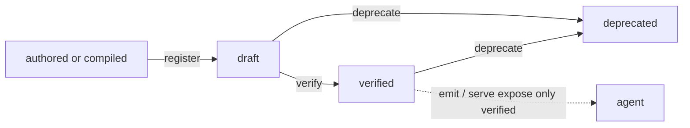

The serve side holds typed skills, moves them through a lifecycle, and delivers
them to coding agents. It is decoupled from the graph: nothing here imports
ingestion or recall. The unit of currency is `SkillIR` (see
[data-model.md](/data-model)).

## Lifecycle

A skill has three states. The status lives on the `SkillIR` and in a denormalized
column for cheap filtering.



- **draft.** Enters here, either hand-authored and loaded with `register`, or
  from the Phase 4 compiler. Not emitted, not served.
- **verified.** Promoted by `relic verify`, which stamps `last_verified_at`. This
  one human gate is the safety boundary. Only verified skills are emitted and
  served.
- **deprecated.** Retired by `relic deprecate`. Stops being emitted or served, and
  `emit` removes its previously written files. A deprecated skill cannot be
  verified again.

## The registry

[`registry/store.py`](https://github.com/buildrelic/relic-core/blob/main/packages/relic-serve/src/relic/registry/store.py) is a SQLite store at
`./data/registry.db` (`REGISTRY_DB_PATH`). The schema is one table:

```sql
CREATE TABLE skills (
    skill_id          TEXT PRIMARY KEY,
    semver            TEXT NOT NULL,
    title             TEXT NOT NULL,
    scope             TEXT NOT NULL,
    status            TEXT NOT NULL,
    owner             TEXT NOT NULL,
    last_verified_at  TEXT,
    document          TEXT NOT NULL,   -- the full SkillIR as JSON
    created_at        TEXT NOT NULL,
    updated_at        TEXT NOT NULL
);
```

The `document` column holds the full `SkillIR` JSON and is the source of truth on
read. The scalar columns are denormalized only for cheap listing and filtering.
Any mutation that changes status also rewrites `document`, so a reloaded `SkillIR`
always matches its row.

Key operations:

- `upsert_skill`: insert or update by `skill_id`, preserving `created_at` across
  updates.
- `get_skill`, `list_skills(status=...)`: read back validated `SkillIR`s.
- `count_by_status`: reads the scalar column only, never deserializes a document
  (used by `doctor`).
- `set_status`, `mark_verified`: status transitions that rewrite the document.

The interface to the rest of the pipeline is `SkillIR` alone. The store is the
durable home for skills once the Phase 4 compiler produces them, and what
`verify`, `emit`, and the MCP server read from. It has no graph or network
dependency. Postgres later, same schema.

## Render: SkillIR to SKILL.md

[`serve/render.py`](https://github.com/buildrelic/relic-core/blob/main/packages/relic-serve/src/relic/serve/render.py) renders a `SkillIR` to
`SKILL.md` markdown through a Jinja template,
[`templates/skill.md.j2`](https://github.com/buildrelic/relic-core/blob/main/packages/relic-serve/src/relic/serve/templates/skill.md.j2). The template uses custom
delimiters (`<< >>` for variables, `<% %>` for blocks) so template syntax does not
collide with the markdown and code inside skill content.

Rendering is deterministic: no LLM, so identical input renders byte-identical
output. That is what makes golden-file snapshot tests possible
([`test_render.py`](https://github.com/buildrelic/relic-core/blob/main/tests/test_render.py)). The rendered doc carries the title,
description, scope, status, owner, inputs, outputs, preconditions, safety checks,
and citations.

## Emit: skills into a repo

[`serve/emit_files.py`](https://github.com/buildrelic/relic-core/blob/main/packages/relic-serve/src/relic/serve/emit_files.py) writes verified skills
into a target repo's `.claude/skills/` tree. `relic emit --repo /path` does three
things:

1. **`emit_verified`.** Write each verified skill to
   `.claude/skills/<id>/SKILL.md`.
2. **`prune_unverified`.** Remove the directory of any registry skill that is no
   longer verified. `emit_verified` only writes, so a skill that was verified,
   emitted, then deprecated would leave a stale `SKILL.md` behind. This reconciles
   the tree.
3. **`emit_catalog`.** Write a `README.md` index of verified skills, or remove a
   stale index if there are none.

Reconciliation is careful: prune only touches directories whose id matches a skill
in the registry. Hand-authored skills under `.claude/skills/` are left alone. So
Relic-managed and hand-written skills coexist in the same tree.

The `.claude/skills/` folder format is a cross-platform standard. The same files
work in Claude Code, Cursor, Codex CLI, and Gemini CLI, and they ship with the
codebase for every teammate.

## Catalog: the human index

[`serve/catalog.py`](https://github.com/buildrelic/relic-core/blob/main/packages/relic-serve/src/relic/serve/catalog.py) renders a browsable markdown
index of skills, linking to each `SKILL.md`. Where emit writes one file per skill,
the catalog is the index over them. `relic catalog` prints it to stdout; `emit`
writes the same content to the target repo's `.claude/skills/README.md`. It is
deterministic and pure, like render.

## Serve: the MCP server

[`serve/mcp_server.py`](https://github.com/buildrelic/relic-core/blob/main/packages/relic-serve/src/relic/serve/mcp_server.py) builds a FastMCP server
that is the single MCP surface for skills and memory both. `relic serve` runs it
over stdio.

`build_server(conn, recall_fn=...)` exposes:

- **Each verified skill as a tool.** Calling the tool returns the rendered
  `SKILL.md`. The tool's input schema is built from `SkillIR.inputs` by
  `input_schema`, so the typed contract is the MCP contract.
- **Each verified skill as a resource** at `skill://<id>`, readable as a markdown
  document.
- **`search_skills`.** Find a skill by text (matched against id, title,
  description, and tags) or by scope.
- **`recall_memory`.** When a recall function is supplied, query the graph and get
  facts with their sources.

Recall is injected, not imported. The CLI builds the engram, wraps it in a recall
function ([`_make_recall_fn`](https://github.com/buildrelic/relic-core/blob/main/packages/relic-cli/src/relic/cli.py)), and passes it in. If building
the engram fails (no OpenAI key, FalkorDB down), `serve` logs to stderr and runs
without `recall_memory`, still serving skills. This keeps `mcp_server.py` free of
any graph or network dependency, and keeps the server useful when memory is
unavailable.

<Warning>
Diagnostics go to stderr on purpose: stdout is the MCP transport, and any stray
bytes on it corrupt the stream.
</Warning>

### Wiring into Claude Code

Add it to `.mcp.json` in the target repo:

```json
{
  "mcpServers": {
    "relic": { "command": "uv", "args": ["run", "relic", "serve"] }
  }
}
```

Any MCP client that speaks stdio works the same way.

## End to end

The downstream half flows draft to verify to emit to serve, decoupled from
ingestion and the graph. The slice test
([`test_pipeline_slice.py`](https://github.com/buildrelic/relic-core/blob/main/tests/test_pipeline_slice.py)) walks it: a
`SkillIR` lands as a draft, is not emitted or served while a draft, is promoted by
`verify`, then emits to `.claude/skills/` and appears as an MCP tool. Today the
draft is a fixture. Later it is the Phase 4 compiler's output.

## What is pending

The Phase 4 compiler is the missing piece that turns the graph into skills. The
detector ([`compile/detect.py`](https://github.com/buildrelic/relic-core/blob/main/packages/relic-graph/src/relic/compile/detect.py)) will find a
recurring procedure with a deterministic graph query plus a support and confidence
threshold. The compiler ([`compile/compiler.py`](https://github.com/buildrelic/relic-core/blob/main/packages/relic-graph/src/relic/compile/compiler.py))
will feed that grounded evidence to Anthropic with `SkillIR` as a structured-output
schema, so the model can only return a valid skill, every field cites its source,
and `status` is always `draft`. Both are docstring-only stubs today. See
[roadmap.md](/roadmap).
